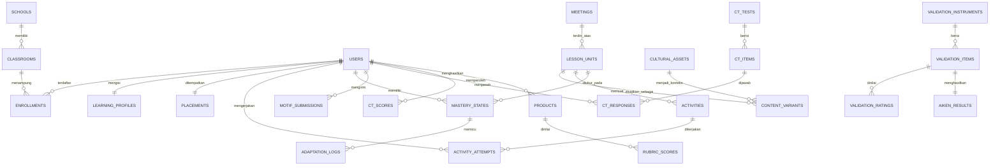

# Cetak Biru Sistem Web
## LMS Pembelajaran Matematika Berdiferensiasi Berbasis Etnomatematika Priangan Timur untuk Pengembangan *Computational Thinking*

**Penelitian** : Penelitian Kompetitif Universitas Siliwangi 2026 — Skema Penelitian Pengembangan Kapasitas (PPKap)
**Judul** : Desain Pembelajaran Digital Adaptif dalam Matematika Berbasis Etnomatematika Priangan Timur untuk Mengembangkan Kemampuan *Computational Thinking* pada Materi Transformasi Geometri
**Tim** : Depi Ardian Nugraha (Ketua), Eko Yulianto, Satya Santika, Vepi Apiati, Reza Mohammad Rizqi (mhs), Aufa Dzakiya Aziza (mhs)
**Dokumen** : Cetak biru sistem — versi 1.0, 9 September 2026
**Status TKT sasaran** : TKT 2–3 (awal) → **TKT 5** (akhir tahun ke-1)

---

## 0. Ringkasan Eksekutif

Sistem yang dibangun bukan LMS generik. Ia adalah **lingkungan belajar digital adaptif bertujuan khusus** yang menjalankan satu desain pembelajaran spesifik: transformasi geometri (translasi, refleksi, rotasi, dilatasi) yang dikonteks-kan lewat artefak budaya Priangan Timur, disajikan secara berdiferensiasi, dan diukur hasilnya pada empat indikator *computational thinking* (CT).

Tiga hal yang menjadi inti kebaruan sistem — dan sekaligus inti nilai HKI-nya:

1. **Mesin Diferensiasi eksplisit** (*rule-based* + adaptasi berkelanjutan). Setiap keputusan sistem — mengapa siswa A diberi varian konten X dan siswa B varian Y — tercatat sebagai aturan yang dapat dibaca manusia. Ini membuat sistem bisa divalidasi ahli (bukan kotak hitam) dan menghasilkan data yang bisa dianalisis untuk artikel.
2. **Motif Builder** — kanvas pemrograman visual tempat siswa menyusun *urutan perintah transformasi* untuk merekonstruksi motif batik/payung/anyaman. Inilah jembatan yang mengubah "transformasi geometri" menjadi "computational thinking" secara terukur: dekomposisi, pengenalan pola, abstraksi, dan algoritma semuanya terjadi di satu layar dan terekam sebagai data.
3. **Modul Penelitian terpadu** — instrumen validasi ahli (Aiken's V otomatis), tes CT pra/pasca (N-Gain otomatis), angket respons, dan lembar observasi hidup di dalam sistem yang sama. Peneliti tidak perlu memindahkan data secara manual; ekspor siap-SPSS tersedia satu klik.

**Keputusan teknis yang sudah diambil:** Laravel + PWA (kode kustom 100% orisinal), mesin adaptif *rule-based* dengan adaptasi berkelanjutan, dikerjakan tim peneliti dengan bantuan asisten AI.

**Usulan nama sistem:** **GEULIS** — *Geometri Etnomatematika untuk Literasi dan Inovasi Siswa*. Nama ini menautkan sistem ke payung geulis Tasikmalaya, mudah diingat guru dan siswa, dan cocok sebagai nama ciptaan pada pendaftaran HKI. Alternatif: **SAWALA** (bahasa Sunda: berdiskusi/bermusyawarah), **ETNOGEO**, **PATRA** (motif/ragam hias).

---

## 1. Cakupan Tahun Pertama (dan yang sengaja ditunda)

Anggaran hosting Rp 2.000.000/12 bulan dan honorarium programmer Rp 1.500.000 memaksa kita disiplin. Cakupan dikunci pada apa yang benar-benar dibutuhkan proposal.

### 1.1 Masuk cakupan

| Kode | Kemampuan | Alasan (rujukan proposal) |
|---|---|---|
| F-01 | Autentikasi & manajemen kelas (siswa, guru, sekolah) | Uji coba di 3 sekolah Priangan Timur |
| F-02 | Asesmen awal: tes kesiapan + profil belajar + minat konteks budaya | "fitur analisis profil belajar siswa" |
| F-03 | Mesin Diferensiasi (konten, proses, produk) | *Differentiated instruction* — inti kebaruan |
| F-04 | Alur belajar adaptif 5 pertemuan | "implementasi ... sebanyak 5 pertemuan di 3 sekolah" |
| F-05 | Konten etnomatematika (batik, payung geulis, anyaman) | Integrasi etnomatematika Priangan Timur |
| F-06 | Alat geometri interaktif (GeoGebra tertanam) | "*interactive geometry tools*" |
| F-07 | **Motif Builder** (penyusun algoritma transformasi) | Pengukuran CT: abstraksi + algoritma |
| F-08 | Bank soal & tes CT pra/pasca dengan penskoran | Tes CT 4 indikator |
| F-09 | Unggah produk siswa + rubrik (diferensiasi produk) | Diferensiasi produk |
| F-10 | Pelacakan kemajuan & analitik (siswa, guru, peneliti) | "*progress tracking*" |
| F-11 | Modul penelitian: validasi ahli, angket, observasi, ekspor | Aiken's V, kepraktisan, N-Gain, *t-test* |
| F-12 | PWA: dapat dipasang di HP, tahan koneksi buruk | Realitas jaringan sekolah di Priangan Timur |

### 1.2 Sengaja **tidak** masuk cakupan tahun pertama

Ditunda ke peta jalan tahun ke-2 s.d. ke-5, dan disebutkan sebagai batasan penelitian:

- Tutor AI/LLM percakapan (biaya API berulang, beban validasi etik, tidak diminta proposal).
- Video konferensi/kelas daring sinkron.
- Multi-mata pelajaran atau multi-materi di luar transformasi geometri.
- Gamifikasi penuh (lencana, papan peringkat kompetitif) — hanya ada indikator kemajuan sederhana.
- Aplikasi native Android/iOS — PWA sudah memenuhi kebutuhan pemasangan di HP.
- Integrasi Dapodik/SSO Belajar.id — impor CSV sudah cukup untuk 3 sekolah.

---

## 2. Arsitektur dan Tumpukan Teknologi

### 2.1 Pilihan dan alasannya

| Lapis | Pilihan | Alasan |
|---|---|---|
| Bahasa & kerangka | **PHP 8.3+ / Laravel (versi stabil terbaru saat instalasi)** | Laravel Herd sudah terpasang di komputer tim; ekosistem matang; berjalan di *shared hosting* murah — kunci untuk pagu Rp 2 jt |
| Antarmuka | **Livewire 3 + Alpine.js + Tailwind CSS** | Satu bahasa (PHP) untuk logika, tanpa API terpisah dan tanpa tim frontend terpisah. Menghemat waktu tim kecil |
| Basis data | **MySQL 8 / MariaDB 10.6+** | Tersedia di semua *shared hosting* Indonesia; dukungan kolom JSON untuk konfigurasi aturan |
| Aset & build | **Vite** | Bawaan Laravel |
| PWA | *Service worker* kustom + *Web App Manifest* | Cache aset & konten pertemuan; siswa tetap bisa membaca materi saat sinyal putus |
| Geometri interaktif | **GeoGebra Apps API** (`deployggb.js`), **di-host sendiri** | Sekolah sering memblokir/lambat ke CDN. Bundel GeoGebra Math Apps disimpan di server sendiri |
| Motif Builder | **Kanvas SVG + mesin transformasi JavaScript buatan sendiri** | Tidak ada pustaka siap pakai yang cocok; ini justru komponen orisinal yang bernilai HKI |
| Antrean & terjadwal | Driver `database` + `cron` bawaan hosting | Tidak butuh Redis/Horizon; menekan biaya |
| Berkas unggahan | Penyimpanan lokal server + kuota per siswa | Menghindari biaya S3 |
| Analisis lanjutan | Ekspor CSV/XLSX → SPSS/JASP | Uji-t dan statistik lanjut tetap di perangkat lunak statistik, sesuai metode proposal |

### 2.2 Diagram arsitektur

```
┌──────────────────────────────────────────────────────────────────┐
│  KLIEN (PWA — HP siswa, laptop guru, lab sekolah)                │
│  Blade + Livewire + Alpine + Tailwind                            │
│  Service Worker: cache materi pertemuan, antre kiriman offline   │
└───────────────────────────┬──────────────────────────────────────┘
                            │ HTTPS
┌───────────────────────────▼──────────────────────────────────────┐
│  APLIKASI LARAVEL                                                │
│                                                                  │
│  ┌───────────────┐  ┌────────────────────┐  ┌─────────────────┐ │
│  │ Modul Belajar │  │ MESIN DIFERENSIASI │  │ Modul Penelitian│ │
│  │ • Pertemuan   │◄─┤ • Penempatan awal  │  │ • Validasi ahli │ │
│  │ • Varian      │  │ • Penguasaan       │  │   (Aiken's V)   │ │
│  │   konten      │  │   berjalan         │  │ • Angket        │ │
│  │ • Aktivitas   │  │ • Aturan naik/     │  │ • Observasi     │ │
│  │ • GeoGebra    │  │   turun/remedial   │  │ • N-Gain        │ │
│  │ • Motif       │  │ • Log alasan       │  │ • Ekspor SPSS   │ │
│  │   Builder     │  └────────────────────┘  └─────────────────┘ │
│  └───────────────┘                                               │
│  ┌───────────────┐  ┌────────────────────┐  ┌─────────────────┐ │
│  │ Asesmen & CT  │  │ Analitik & Rapor   │  │ Administrasi    │ │
│  └───────────────┘  └────────────────────┘  └─────────────────┘ │
└───────────────────────────┬──────────────────────────────────────┘
                            │
┌───────────────────────────▼──────────────────────────────────────┐
│  DATA: MySQL  •  Berkas: penyimpanan lokal  •  Log: berkas       │
└──────────────────────────────────────────────────────────────────┘
```

### 2.3 Peran pengguna

| Peran | Siapa | Kemampuan utama |
|---|---|---|
| **Siswa** | SMA/MA kelas XI, 3 sekolah | Mengerjakan asesmen awal, menempuh alur belajar adaptif, mengerjakan aktivitas & Motif Builder, mengunggah produk, melihat kemajuan sendiri |
| **Guru** | Guru matematika mitra | Mengelola kelas, memantau papan kelas, menilai produk dengan rubrik, memberi umpan balik, menandai siswa yang perlu bantuan |
| **Validator (Ahli)** | Ahli pendidikan matematika, ahli teknologi pembelajaran, praktisi | Menelaah produk & mengisi lembar validasi berskala; skor langsung diolah jadi Aiken's V |
| **Observer** | Pembantu lapangan (3 orang) | Mengisi lembar observasi keterlaksanaan pembelajaran per pertemuan lewat HP |
| **Peneliti** | Tim peneliti | Mengatur kelompok eksperimen/kontrol, memantau kelengkapan data, mengekspor data, melihat rekap analitik |
| **Admin** | Pengelola sistem | Mengelola pengguna, sekolah, konten, cadangan data |

Satu akun dapat memegang lebih dari satu peran (mis. peneliti sekaligus admin) melalui tabel pivot peran.

---

## 3. Mesin Diferensiasi — Jantung Sistem

Ini komponen yang membedakan sistem ini dari LMS mana pun. Rancangannya sengaja **eksplisit dan dapat dijelaskan**, karena tiga alasan: harus bisa divalidasi ahli, harus bisa dipertanggungjawabkan dalam artikel, dan guru harus paham mengapa siswanya diarahkan ke jalur tertentu.

### 3.1 Tiga dimensi diferensiasi (Tomlinson) → tiga sumbu keputusan sistem

| Dimensi Tomlinson | Yang diatur sistem | Sumber keputusan |
|---|---|---|
| **Konten** (*apa* yang dipelajari) | Tingkat kedalaman & kerumitan materi: **L1 Dasar / L2 Berkembang / L3 Mahir** | Skor tes kesiapan + penguasaan berjalan |
| **Proses** (*bagaimana* dipelajari) | Modus representasi & tingkat perancah: **Visual-Manipulatif / Simbolik-Analitis / Naratif-Kontekstual** | Profil belajar + minat konteks budaya |
| **Produk** (*apa* yang dihasilkan) | Bentuk tagihan akhir yang dapat dipilih siswa: desain motif, laporan algoritmik, video penjelasan, atau poster infografis | Pilihan siswa, dibatasi oleh level konten |

Perhatikan pembagian tugasnya: **konten** ditentukan sistem berdasarkan bukti kinerja, **proses** ditentukan oleh preferensi belajar, **produk** dipilih siswa. Ini penting secara pedagogis — diferensiasi bukan berarti sistem mengambil alih semua keputusan.

### 3.2 Penempatan awal (*placement*)

Dijalankan sekali, sebelum Pertemuan 1.

**Masukan:**
- `R` = skor Tes Kesiapan Prasyarat (koordinat Kartesius, konsep bangun datar, simetri, operasi bilangan bulat) — 15 butir, skala 0–100.
- `P` = Angket Profil Belajar — 20 pernyataan, menghasilkan kecenderungan pada tiga modus (bukan label kaku "tipe siswa", melainkan skor kecenderungan 0–100 untuk masing-masing modus).
- `B` = Angket Minat Konteks Budaya — 6 pernyataan, memilih artefak budaya yang paling menarik bagi siswa (batik / payung geulis / anyaman) untuk digunakan sebagai contoh utama.

**Aturan penempatan konten:**

```
JIKA  R < 60   MAKA level_awal = L1 (Dasar)
JIKA  60 ≤ R < 80  MAKA level_awal = L2 (Berkembang)
JIKA  R ≥ 80   MAKA level_awal = L3 (Mahir)
```

**Aturan penempatan proses:**

```
modus_utama = argmax(P_visual, P_simbolik, P_naratif)
JIKA selisih dua skor tertinggi < 10  MAKA modus = Campuran (sistem menyajikan dua modus berdampingan)
```

**Aturan konteks:**

```
artefak_utama = pilihan tertinggi pada B
(artefak lain tetap muncul sebagai contoh pembanding — siswa tidak dikurung pada satu budaya)
```

> **Catatan pedagogis penting.** Profil belajar dipakai untuk *menawarkan* representasi yang paling nyaman lebih dahulu, **bukan** untuk membatasi siswa hanya pada satu modus. Semua siswa tetap menemui ketiga representasi sepanjang lima pertemuan; yang berbeda hanya urutan dan penekanannya. Perancangan ini disengaja untuk menghindari kritik terhadap teori gaya belajar yang kaku, dan sebaiknya dinyatakan eksplisit dalam artikel.

### 3.3 Adaptasi berkelanjutan (*continuous adaptation*)

Setiap **unit materi** (sub-bagian dalam satu pertemuan) diakhiri satu **Pemeriksaan Penguasaan** (*mastery check*) berisi 3–5 butir. Setelah setiap pemeriksaan, sistem memperbarui **status penguasaan** siswa untuk unit itu.

**Rumus pembaruan penguasaan** (rerata bergerak berbobot — sederhana, transparan, mudah dijelaskan ke validator):

```
M_baru  =  α · M_lama  +  (1 − α) · s
```

dengan
- `M` ∈ [0, 1] = tingkat penguasaan pada unit tersebut (nilai awal = R/100)
- `s` ∈ [0, 1] = proporsi skor pemeriksaan terakhir
- `α = 0,4` (bobot riwayat) — nilainya disimpan sebagai parameter yang dapat disetel dan **ikut divalidasi ahli**

**Aturan keputusan setelah pemeriksaan:**

| Kondisi | Keputusan sistem | Kode aturan |
|---|---|---|
| `M ≥ 0,80` **dan** level < L3 | Naikkan level konten satu tingkat; lewati latihan rutin; buka **tugas pengayaan** | `RULE_PROMOTE` |
| `M ≥ 0,80` **dan** level = L3 | Buka **tantangan Motif Builder tingkat lanjut** | `RULE_ENRICH` |
| `0,50 ≤ M < 0,80` | Lanjut pada level sama + 1 set **latihan penguatan** terpilih dari butir yang salah | `RULE_REINFORCE` |
| `M < 0,50`, iterasi remedial ≤ 2 | Turunkan level satu tingkat; sajikan **perancah** (contoh terbimbing, animasi langkah demi langkah, GeoGebra terpandu); ulangi pemeriksaan dengan butir setara | `RULE_REMEDIATE` |
| `M < 0,50`, iterasi remedial > 2 | Hentikan pengulangan; **tandai untuk guru** ("perlu pendampingan langsung"); tetap buka materi berikutnya agar siswa tidak tertinggal | `RULE_ESCALATE` |
| Waktu pengerjaan < 20% median kelas **dan** skor rendah | Tandai **dugaan tebak-tebakan**; minta pengulangan, tidak memicu penurunan level | `RULE_GUESS_GUARD` |

**Batas pengaman (wajib ada):**
- Perpindahan level maksimal **satu tingkat per pemeriksaan** — mencegah siswa terlempar naik-turun.
- Level tidak pernah turun di bawah L1, tidak pernah naik di atas L3.
- Guru dapat **mengesampingkan (override) keputusan sistem** kapan saja; override tercatat beserta alasannya. Ini sekaligus menjadi data kualitatif yang kaya untuk artikel.
- Setiap keputusan menulis satu baris ke tabel `adaptation_logs`: siapa, unit apa, aturan mana yang menyala, nilai M sebelum/sesudah, hasil keputusan. **Tabel inilah bukti empiris bahwa sistemnya benar-benar adaptif** — bukan sekadar klaim.

### 3.4 Contoh jejak keputusan (untuk dokumentasi validasi)

```
Siswa  : S-014  (SMAN X, kelas XI-3)
Awal   : R = 72 → L2 ; P_visual 78 / P_simbolik 55 / P_naratif 61 → modus Visual-Manipulatif
         B → payung geulis
Unit 2.1 (Refleksi terhadap sumbu-x) : M_lama 0,72 ; s = 0,40
         M_baru = 0,4(0,72) + 0,6(0,40) = 0,528  → RULE_REINFORCE
         Tindakan: tetap L2, tambah 4 butir latihan penguatan (butir salah: tanda ordinat)
Unit 2.2 (Refleksi terhadap garis y = x) : M_lama 0,528 ; s = 0,20
         M_baru = 0,4(0,528) + 0,6(0,20) = 0,331  → RULE_REMEDIATE (iterasi 1)
         Tindakan: turun ke L1, sajikan animasi lipatan motif batik + GeoGebra terpandu
```

---

## 4. Peta Konten: Etnomatematika × Transformasi Geometri × CT

### 4.1 Artefak budaya dan konsep matematisnya

| Artefak | Asal | Konsep transformasi utama | Konsep pendukung |
|---|---|---|---|
| **Anyaman bambu Rajapolah** | Rajapolah, Kab. Tasikmalaya | **Translasi** — pola kisi berulang dua arah | Vektor perpindahan, *tessellation*, komposisi translasi |
| **Batik Tasikmalaya (motif sawoan, merak ngibing)** | Kota/Kab. Tasikmalaya | **Refleksi** — simetri lipat pada ragam hias | Sumbu simetri, refleksi terhadap garis y = x dan y = −x |
| **Payung geulis** | Panyingkiran, Kota Tasikmalaya | **Rotasi** — simetri putar n-lipat pada jari-jari payung | Sudut putar 360°/n, pusat rotasi, rotasi berulang |
| **Payung geulis & batik (motif berlapis)** | — | **Dilatasi** — motif konsentris membesar/mengecil | Faktor skala k, pusat dilatasi, kesebangunan |
| **Ketiganya (proyek akhir)** | — | **Komposisi transformasi** | Urutan operasi, sifat non-komutatif, matriks transformasi |

> **Yang harus dikerjakan tim pada tahap *preliminary research* (Bulan 3–4):** dokumentasi lapangan artefak asli di Tasikmalaya, Ciamis, dan Banjar — foto resolusi tinggi, wawancara perajin, dan verifikasi bahwa klaim matematis di atas benar-benar ada pada artefaknya, bukan diada-adakan. Etnomatematika yang dipaksakan adalah kelemahan yang paling mudah ditembak *reviewer*. Setiap aset yang masuk sistem wajib disertai metadata: nama motif, perajin/sumber, lokasi, tanggal, izin penggunaan.

### 4.2 Struktur lima pertemuan

| Pert. | Materi | Artefak utama | Fokus CT | Tagihan |
|---|---|---|---|---|
| **1** | Translasi | Anyaman Rajapolah | **Pengenalan pola** — menemukan satuan pengulangan pada kisi anyaman | Motif Builder: bangun satu bidang anyaman hanya dengan perintah translasi |
| **2** | Refleksi | Batik sawoan | **Dekomposisi** — memecah motif batik menjadi motif dasar + sumbu-sumbu lipatnya | Motif Builder: rekonstruksi motif bersimetri lipat |
| **3** | Rotasi | Payung geulis | **Pengenalan pola + abstraksi** — merumuskan sudut putar dari banyaknya jari-jari | Motif Builder: bangun rozet payung dengan rotasi berulang |
| **4** | Dilatasi | Motif berlapis payung/batik | **Abstraksi** — menyatakan pembesaran sebagai faktor skala terhadap pusat | Motif Builder: susun motif konsentris; bandingkan k > 1, 0 < k < 1, k < 0 |
| **5** | Komposisi transformasi + Proyek | Pilihan siswa | **Algoritma** — menyusun dan mengoptimalkan urutan perintah | **Proyek akhir**: rancang motif orisinal + tuliskan algoritmanya + jelaskan (bentuk produk dipilih siswa) |

Setiap pertemuan memiliki struktur baku:
1. **Jangkar budaya** (3–5 menit) — foto/video artefak asli + pertanyaan pemantik
2. **Eksplorasi** — GeoGebra terpandu sesuai level dan modus
3. **Formalisasi** — rumus/aturan transformasi, disajikan sesuai modus (visual / simbolik / naratif)
4. **Latihan berjenjang** — butir soal sesuai level
5. **Pemeriksaan penguasaan** — 3–5 butir → memicu Mesin Diferensiasi
6. **Motif Builder** — tugas algoritmik
7. **Refleksi singkat** — 2 pertanyaan terbuka (data kualitatif)

### 4.3 Pemetaan indikator CT → bukti terukur dalam sistem

Ini tabel yang paling dibutuhkan saat menulis artikel dan menyusun instrumen. Setiap indikator CT harus punya jejak data, bukan sekadar klaim.

| Indikator CT | Definisi operasional dalam konteks transformasi geometri | Bukti yang direkam sistem |
|---|---|---|
| **Dekomposisi** | Memecah motif/masalah kompleks menjadi bagian-bagian yang dapat ditangani sendiri-sendiri | Butir tes tipe-D; **jumlah dan ketepatan "motif dasar" yang ditandai siswa** pada alat Penanda Motif sebelum membangun |
| **Pengenalan pola** | Mengenali keberulangan, simetri, dan keteraturan pada artefak | Butir tes tipe-P; ketepatan menjawab "satuan pengulangan" dan "banyak simetri" pada aktivitas eksplorasi |
| **Abstraksi** | Menyatakan motif/situasi konkret sebagai koordinat, vektor, sudut, atau faktor skala — membuang detail tak relevan | Butir tes tipe-A; ketepatan parameter yang diisi siswa pada blok perintah (mis. menuliskan rotasi 45° dari 8 jari-jari payung) |
| **Algoritma** | Menyusun urutan perintah transformasi yang benar, lengkap, dan efisien untuk menghasilkan motif sasaran | Butir tes tipe-Al; **skor Motif Builder**: kemiripan hasil dengan sasaran (0–100), jumlah langkah vs. langkah minimum, jumlah percobaan, penggunaan perulangan |

**Skor kemiripan Motif Builder** dihitung dengan membandingkan hasil susunan siswa terhadap motif sasaran pada kisi raster (mis. 200 × 200), memakai *Intersection over Union* (IoU):

```
Kemiripan = ( luas irisan / luas gabungan ) × 100
Lolos jika Kemiripan ≥ 90
Efisiensi = ( langkah_minimum / langkah_siswa ) × 100   (dilaporkan terpisah, tidak mengurangi kelulusan)
```

Skor Motif Builder **melengkapi**, bukan menggantikan, tes CT berbentuk soal. Tes CT tetap menjadi instrumen utama untuk N-Gain dan uji-t sesuai proposal; data Motif Builder menjadi bukti proses yang memperkuat pembahasan.

---

## 5. Model Data

### 5.1 Kelompok tabel

**A. Identitas & organisasi**

| Tabel | Isi pokok |
|---|---|
| `users` | id, nama, username, email (opsional), password, sekolah_id, aktif |
| `roles`, `role_user` | siswa, guru, validator, observer, peneliti, admin |
| `schools` | nama, npsn, kabupaten_kota (Tasikmalaya/Ciamis/Banjar), alamat |
| `classrooms` | sekolah_id, nama kelas, guru_id, tahun_ajaran, **kelompok_riset** (eksperimen/kontrol), kode_gabung |
| `classroom_student` | pivot kelas–siswa, tanggal bergabung, status |

> **Catatan penting soal login siswa.** Banyak siswa SMA tidak punya surel aktif dan lupa kata sandi adalah gangguan terbesar saat pengambilan data. Gunakan **username = NIS** dan **PIN 6 digit** yang dicetak guru per kelas, dengan opsi kode kelas + nama untuk masuk pertama kali. Surel bersifat opsional.

**B. Profil & penempatan**

| Tabel | Isi pokok |
|---|---|
| `readiness_tests`, `readiness_items`, `readiness_responses` | Tes kesiapan prasyarat |
| `learning_profiles` | user_id, skor_visual, skor_simbolik, skor_naratif, modus_utama, artefak_pilihan, tanggal_isi |
| `placements` | user_id, skor_R, level_awal (L1/L2/L3), modus, artefak, dibuat_pada |

**C. Konten pembelajaran**

| Tabel | Isi pokok |
|---|---|
| `meetings` | urutan 1–5, judul, materi, artefak_utama, fokus_ct, capaian_pembelajaran |
| `lesson_units` | meeting_id, urutan, judul, tipe (jangkar/eksplorasi/formalisasi/latihan/pemeriksaan/motif/refleksi) |
| `content_variants` | lesson_unit_id, **level** (L1/L2/L3), **modus** (visual/simbolik/naratif), badan_konten (HTML), berkas_media, konfigurasi_geogebra (JSON) |
| `cultural_assets` | nama_motif, artefak, perajin_sumber, lokasi, tanggal_dokumentasi, izin, berkas, catatan_matematis |
| `activities` | lesson_unit_id, tipe (geogebra/motif_builder/kuis/unggah), konfigurasi (JSON), skor_maks |

**D. Kegiatan belajar & adaptasi**

| Tabel | Isi pokok |
|---|---|
| `enrollments` | user_id, classroom_id, level_kini, modus_kini, status |
| `activity_attempts` | user_id, activity_id, jawaban (JSON), skor, durasi_detik, percobaan_ke, waktu_mulai/selesai |
| `mastery_states` | user_id, lesson_unit_id, nilai_M, level_saat_itu, iterasi_remedial, diperbarui_pada |
| `adaptation_logs` | user_id, lesson_unit_id, kode_aturan, M_sebelum, M_sesudah, level_sebelum, level_sesudah, keputusan, dipicu_pada |
| `teacher_overrides` | guru_id, siswa_id, lesson_unit_id, level_lama, level_baru, alasan, waktu |
| `motif_submissions` | user_id, activity_id, urutan_perintah (JSON), skor_kemiripan, langkah_siswa, langkah_minimum, efisiensi, lolos, cuplikan_svg |

**E. Asesmen CT & produk**

| Tabel | Isi pokok |
|---|---|
| `ct_tests` | jenis (pretest/posttest), judul, aktif, durasi_menit |
| `ct_items` | ct_test_id, indikator (D/P/A/Al), stimulus (konteks budaya), pertanyaan, tipe (PG/uraian), kunci, rubrik_butir, skor_maks |
| `ct_responses` | user_id, ct_item_id, jawaban, skor_otomatis, skor_manual, penilai_id, catatan |
| `ct_scores` | user_id, ct_test_id, skor_D, skor_P, skor_A, skor_Al, skor_total, persen |
| `products` | user_id, meeting_id, bentuk (desain/laporan/video/poster), berkas_atau_tautan, deskripsi, waktu_kirim |
| `rubrics`, `rubric_criteria`, `rubric_scores` | Rubrik analitik empat tingkat untuk produk |

**F. Modul penelitian**

| Tabel | Isi pokok |
|---|---|
| `validation_instruments` | nama (mis. "Validasi Ahli Materi"), aspek, skala_maks (mis. 5) |
| `validation_items` | instrumen_id, aspek, pernyataan |
| `expert_validations` | validator_id, instrumen_id, status, dikirim_pada |
| `validation_ratings` | expert_validation_id, validation_item_id, skor, saran_perbaikan |
| `aiken_results` | validation_item_id, nilai_V, kategori, n_penilai, dihitung_pada |
| `questionnaires`, `questionnaire_items`, `questionnaire_responses` | Angket respons siswa & guru (kepraktisan) |
| `observations`, `observation_items`, `observation_records` | Lembar observasi keterlaksanaan per pertemuan |
| `reflections` | user_id, meeting_id, pertanyaan, jawaban (data kualitatif) |
| `data_exports` | jenis, parameter, berkas, dibuat_oleh, dibuat_pada |

**G. Sistem**

`activity_log` (jejak audit), `sessions`, `jobs`, `failed_jobs`, `consents` (persetujuan siswa/orang tua).

### 5.2 Relasi inti (ERD ringkas)



### 5.3 Kunci desain data yang sering terlewat

- **`content_variants` adalah kartesian yang dikelola, bukan diledakkan.** Secara teori 3 level × 3 modus = 9 varian per unit. Dalam praktik banyak sel dapat memakai varian yang sama. Gunakan kolom `level` dan `modus` yang boleh berisi `*` (berlaku untuk semua), sehingga tim konten cukup menulis 3–5 varian per unit, bukan 9. **Tanpa aturan ini, beban produksi konten akan meledak dan jadwal Bulan 6–8 tidak akan tercapai.**
- **Semua skor disimpan mentah**, bukan hanya hasil olahan — agar analisis ulang untuk artikel tetap mungkin.
- **`kelompok_riset` melekat pada kelas, bukan pada siswa** — sesuai desain kuasi-eksperimen dengan kelas utuh, dan menghindari masalah etik memilah siswa dalam satu kelas.

---

## 6. Modul Penelitian di Dalam Sistem

Bagian ini yang membuat sistem tidak hanya berguna bagi siswa, tetapi juga memotong berminggu-minggu pekerjaan administratif tim.

### 6.1 Validasi ahli dengan Aiken's V otomatis

Validator masuk lewat tautan bertanda (tanpa perlu membuat akun rumit), menelaah produk (sistem + modul + instrumen), lalu mengisi lembar berskala 1–5 disertai kolom saran per butir.

Sistem menghitung indeks Aiken untuk tiap butir:

```
V = Σ s  /  [ n · (c − 1) ]
dengan  s = r − l0
        r  = skor yang diberikan penilai
        l0 = skor terendah yang mungkin (1)
        c  = banyaknya kategori skor (5)
        n  = banyaknya penilai
```

Keluaran: tabel V per butir, V per aspek, V keseluruhan, kategori kevalidan, serta **rekap saran perbaikan** yang otomatis tersusun menjadi daftar tugas revisi. Kriteria yang dipakai sesuai proposal: valid bila berada pada tingkat kevalidan **minimal sedang**.

### 6.2 Kepraktisan — angket respons siswa & guru

Angket muncul otomatis setelah pertemuan terakhir. Sistem menghitung skor rerata dan mengategorikannya; produk dinyatakan praktis bila berada pada kategori **minimal praktis** sesuai kriteria proposal. Ambang kategori disimpan sebagai parameter yang dapat disetel agar cocok dengan rujukan yang dipakai tim.

### 6.3 Keefektifan — N-Gain otomatis

```
N-Gain = ( skor_posttest − skor_pretest ) / ( skor_maksimum − skor_pretest )
```

Sistem menampilkan N-Gain per siswa, per kelas, per indikator CT, dan per kelompok (eksperimen/kontrol), lengkap dengan statistik deskriptif (rerata, simpangan baku, minimum, maksimum, n). **Uji-t sampel independen tetap dijalankan di SPSS/JASP** — sistem hanya menyiapkan datanya. Pilihan ini disengaja: hasil statistik inferensial untuk artikel sebaiknya berasal dari perangkat lunak statistik baku yang dapat diaudit *reviewer*, bukan dari kode buatan sendiri.

### 6.4 Ekspor data siap analisis

Satu tombol menghasilkan berkas .xlsx multi-lembar:

| Lembar | Isi |
|---|---|
| `siswa` | ID anonim, sekolah, kelas, kelompok, level awal, modus, jenis kelamin |
| `ct_pretest` / `ct_posttest` | Skor per indikator (D, P, A, Al) dan total |
| `ngain` | N-Gain total & per indikator |
| `mastery` | Nilai M akhir per unit materi |
| `adaptasi` | Rekap aturan yang menyala per siswa (berapa kali promosi, remedial, eskalasi) |
| `motif` | Skor kemiripan, langkah, efisiensi, jumlah percobaan |
| `angket_siswa` / `angket_guru` | Skor butir dan total |
| `validasi_ahli` | Skor mentah + V per butir |
| `observasi` | Skor keterlaksanaan per pertemuan per kelas |
| `refleksi` | Jawaban terbuka siswa (untuk analisis kualitatif) |

**Anonimisasi wajib:** ekspor untuk analisis dan publikasi memakai ID anonim (`S-001`, `S-002`, …); tabel pemetaan ke identitas asli hanya dapat diakses ketua peneliti.

### 6.5 Papan pantau kelengkapan data

Layar khusus peneliti yang menampilkan, per kelas: berapa siswa sudah mengisi asesmen awal, menyelesaikan tiap pertemuan, mengerjakan pretest/posttest, mengisi angket. **Ini fitur kecil dengan dampak besar** — data yang bolong baru ketahuan saat analisis adalah penyebab paling umum molornya penelitian pengembangan.

---

## 7. Peta Layar dan Alur Pengguna

### 7.1 Alur siswa (pertama kali)

```
Masuk (NIS + PIN)
   └─► Persetujuan penelitian (informed consent) ──► ditolak? akses belajar tetap diberi,
   │                                                  data tidak dipakai untuk penelitian
   └─► Tes Kesiapan Prasyarat (15 butir, ±20 menit)
   └─► Angket Profil Belajar (20 pernyataan, ±7 menit)
   └─► Angket Minat Konteks Budaya (6 pernyataan, ±2 menit)
   └─► Pretest CT (±60 menit, dijadwalkan guru)
   └─► [MESIN DIFERENSIASI: penempatan]
   └─► Beranda Siswa — "Jalur Belajarmu" 5 pertemuan
```

### 7.2 Alur siswa (per pertemuan)

```
Kartu Pertemuan  ──►  Jangkar Budaya (foto/video artefak + pemantik)
                 ──►  Eksplorasi GeoGebra (varian sesuai level & modus)
                 ──►  Formalisasi (varian sesuai level & modus)
                 ──►  Latihan berjenjang
                 ──►  PEMERIKSAAN PENGUASAAN ──► [MESIN DIFERENSIASI]
                                                    ├─ promosi  → pengayaan
                                                    ├─ penguatan → latihan tambahan
                                                    └─ remedial  → perancah, ulangi
                 ──►  MOTIF BUILDER (tugas algoritmik)
                 ──►  Refleksi 2 pertanyaan
                 ──►  Pertemuan berikutnya terbuka
```

### 7.3 Daftar layar

| Kode | Layar | Peran |
|---|---|---|
| S-01 | Masuk / gabung kelas | Siswa |
| S-02 | Persetujuan penelitian | Siswa |
| S-03 | Asesmen awal (tes kesiapan, profil, minat) | Siswa |
| S-04 | Beranda "Jalur Belajarmu" | Siswa |
| S-05 | Halaman pertemuan (jangkar → refleksi) | Siswa |
| S-06 | Ruang GeoGebra | Siswa |
| S-07 | **Motif Builder** | Siswa |
| S-08 | Pemeriksaan penguasaan & umpan balik adaptif | Siswa |
| S-09 | Kemajuanku (grafik penguasaan, lencana CT) | Siswa |
| S-10 | Unggah produk & lihat rubrik | Siswa |
| S-11 | Tes CT (pra/pasca) | Siswa |
| G-01 | Papan kelas (peta panas penguasaan) | Guru |
| G-02 | Rapor siswa perorangan + tombol override | Guru |
| G-03 | Penilaian produk dengan rubrik | Guru |
| G-04 | Daftar "perlu pendampingan" | Guru |
| G-05 | Cetak kartu PIN kelas | Guru |
| V-01 | Lembar validasi ahli | Validator |
| V-02 | Rekap Aiken's V + saran | Peneliti |
| O-01 | Lembar observasi pertemuan (ramah HP) | Observer |
| P-01 | Papan pantau kelengkapan data | Peneliti |
| P-02 | Analitik penelitian (N-Gain, deskriptif) | Peneliti |
| P-03 | Ekspor data | Peneliti |
| A-01 | Manajemen konten & varian | Admin |
| A-02 | Manajemen pengguna, sekolah, kelas | Admin |
| A-03 | Pengaturan parameter adaptasi (α, ambang) | Admin |

Wireframe visual seluruh layar kunci tersedia pada berkas `02-wireframe/wireframe-lms-geulis.html`.

---

## 8. Infrastruktur, Biaya, dan Operasional

### 8.1 Rencana hosting (pagu Rp 2.000.000 / 12 bulan)

**Tahap 1 — Pengembangan (Bulan 5–8): Rp 0**
Berjalan lokal di Laravel Herd pada komputer tim. Berbagi pratinjau ke tim lewat *tunnel* saat perlu.

**Tahap 2 — Validasi & uji coba terbatas (Bulan 8–10): *shared hosting* premium**
- Domain `.my.id` atau `.id` : ± Rp 200.000/tahun
- *Shared hosting* PHP 8.3, ≥ 5 GB SSD, MySQL, SSL gratis: ± Rp 900.000–1.400.000/tahun
- Beban: 10 siswa uji terbatas + validator + tim → sangat ringan

**Tahap 3 — Implementasi 3 sekolah (Bulan 10–12): naikkan bila perlu ke VPS**
- Beban puncak realistis: 3 sekolah × ±35 siswa = **±105 pengguna serentak**, dan biasanya tidak serentak karena jadwal pelajaran berbeda.
- Bila *shared hosting* mulai tersendat, migrasi ke VPS 2 vCPU / 2–4 GB RAM: ± Rp 120.000–180.000/bulan.
- **Total tahunan tetap di bawah Rp 2.000.000** bila *shared hosting* dipakai 8 bulan pertama dan VPS hanya 3–4 bulan terakhir.

Cadangkan Rp 300.000 dari pagu sebagai penyangga untuk peningkatan mendadak saat hari pengambilan data.

### 8.2 Ketahanan di lapangan — hal yang paling sering menggagalkan uji coba

| Risiko | Mitigasi teknis |
|---|---|
| Wi-Fi sekolah lambat/putus | PWA menyimpan materi pertemuan berikutnya di *cache*; jawaban diantre lokal dan dikirim ulang saat sinyal kembali |
| GeoGebra dari CDN diblokir/lambat | Bundel GeoGebra Math Apps **di-host sendiri** di server; uji di jaringan sekolah **sebelum** hari-H |
| Aset gambar besar (foto batik resolusi tinggi) | Semua gambar dikonversi ke WebP + disajikan responsif; batas 200 KB per gambar tampilan |
| Siswa lupa PIN | Guru dapat mengatur ulang PIN dari layar G-05; kartu PIN dicetak cadangan |
| HP siswa layar kecil | Rancang **mobile-first**; Motif Builder wajib dapat digunakan pada lebar 360 px |
| Server penuh saat 3 kelas serentak | Uji beban sederhana (mis. `ab`/`k6`, 100 pengguna) sebelum implementasi |
| Data hilang | Cadangan otomatis harian basis data + berkas; salinan mingguan diunduh ke penyimpanan lokal tim |

### 8.3 Rencana pengujian

- **Uji unit** untuk Mesin Diferensiasi — setiap aturan (`RULE_PROMOTE` s.d. `RULE_GUESS_GUARD`) wajib punya kasus uji. Ini bagian kode yang paling berbahaya bila salah, karena kesalahannya tidak kelihatan sampai data sudah terkumpul.
- **Uji fitur** untuk alur masuk, pengiriman aktivitas, penilaian, ekspor.
- **Uji jelajah** oleh dua anggota mahasiswa memakai HP asli di jaringan sekolah.
- **Uji beban** sebelum implementasi.

---

## 9. Keamanan, Etika, dan Perlindungan Data

Subjek penelitian adalah anak di bawah umur. Ini bukan bagian yang bisa ditawar.

- **Minimalkan data.** Kumpulkan hanya: nama, NIS, kelas, sekolah, jenis kelamin. **Jangan** kumpulkan NIK, alamat rumah, nomor HP pribadi siswa, atau foto wajah.
- **Persetujuan berlapis.** Persetujuan orang tua/wali (formulir kertas melalui sekolah) + persetujuan siswa di dalam sistem. Siswa yang menolak tetap boleh memakai sistem untuk belajar; datanya diberi tanda dan dikeluarkan dari analisis.
- **Izin penelitian** dari Dinas Pendidikan Kota Tasikmalaya, Ciamis, dan Banjar sudah dianggarkan di RAB (uang harian survei pengurusan izin) — urus di Bulan 3–4, jangan menunggu.
- **Keamanan teknis:** HTTPS wajib, kata sandi/PIN di-*hash*, pembatasan laju percobaan masuk, otorisasi berbasis peran pada setiap rute, perlindungan CSRF (bawaan Laravel), unggahan divalidasi jenis dan ukuran, jejak audit untuk akses data.
- **Retensi:** data mentah disimpan 5 tahun (mendukung peta jalan lima tahun), lalu dihapus atau dianonimkan permanen.
- **Aset budaya:** setiap foto artefak wajib punya izin dari perajin/pemilik dan atribusi yang ditampilkan di layar. Menggunakan motif batik tanpa izin dalam produk berbayar/ber-HKI adalah risiko hukum sekaligus risiko etis terhadap komunitas yang justru ingin kita hargai.

---

## 10. Strategi Hak Kekayaan Intelektual

Luaran wajib mencakup Hak Cipta perangkat lunak LMS, ditambah dua luaran tambahan berupa Hak Cipta (modul pembelajaran dan panduan implementasi).

Luaran wajib publikasi menargetkan **JP2M (SINTA 3)** atau **KREANO: Jurnal Matematika Kreatif-Inovatif (SINTA 2)** sesuai proposal. Naskah sebaiknya mulai disusun pada Bulan 10 memakai data yang sudah masuk, bukan menunggu seluruh analisis selesai pada Bulan 12 — antrean *review* jurnal terakreditasi jauh lebih panjang daripada sisa waktu penelitian.

**Yang perlu disiapkan sejak awal, bukan di akhir:**

1. **Kepemilikan kode bersih.** Seluruh kode inti ditulis tim. Ketergantungan pihak ketiga hanya yang berlisensi permisif (Laravel MIT, Tailwind MIT, Alpine MIT, Livewire MIT). GeoGebra dipakai **tertanam sesuai lisensi non-komersialnya** dan **bukan bagian dari ciptaan yang didaftarkan** — nyatakan ini eksplisit di deskripsi ciptaan agar tidak menjadi masalah.
2. **Riwayat Git sejak baris pertama.** Repositori privat dengan riwayat *commit* yang rapi adalah bukti penciptaan terkuat sekaligus termurah.
3. **Tiga pendaftaran terpisah** (sesuai luaran wajib + tambahan):
   - Program Komputer: sistem GEULIS (sertakan cuplikan kode sumber sesuai ketentuan DJKI)
   - Buku/Modul: Modul Transformasi Geometri Berbasis Etnomatematika Priangan Timur
   - Buku/Panduan: Panduan Penggunaan LMS bagi Guru Matematika
4. **Anggaran** Rp 400.000 untuk pendaftaran HKI LMS sudah tersedia di RAB; daftarkan pada Bulan 11 agar sertifikat/bukti terbit sebelum pelaporan akhir.

---

## 11. Jadwal Pengembangan (selaras jadwal proposal)

### 11.1 Pemetaan pekerjaan sistem ke tiga tahap EDR (Plomp)

Proposal memakai *Educational Design Research* model Plomp. Supaya laporan dan artikel tidak perlu menerjemahkan ulang, setiap pekerjaan sistem sejak awal diberi label tahap EDR-nya.

| Tahap Plomp | Bulan | Pekerjaan sistem | Keluaran tahap |
|---|---|---|---|
| **Preliminary research** | 3–4 | Analisis kebutuhan bersama guru & siswa; dokumentasi lapangan artefak; kunci daftar kebutuhan; cetak biru & wireframe | Dokumen kebutuhan, cetak biru, korpus aset budaya bermetadata |
| **Prototyping phase** | 5–9 | Sprint 0–5; produksi ±140 varian konten; siklus evaluasi formatif: *self-evaluation* (uji unit & uji fitur) → *expert review* (validasi ahli, Aiken's V) → *one-to-one & small group* (uji coba 10 siswa) | Prototipe LMS yang valid dan praktis, beserta bukti revisinya |
| **Assessment phase** | 10–12 | Implementasi 5 pertemuan di 3 sekolah; pengumpulan data pra/pasca; analisis keefektifan | Bukti keefektifan (N-Gain, uji-t), TKT 5 tercapai |

Perhatikan bahwa *prototyping phase* pada Plomp adalah rangkaian **siklus evaluasi formatif**, bukan satu kali jadi. Sprint 0–5 dan tiga gelombang evaluasi di atas adalah wujud konkretnya — susun laporan dengan bahasa itu, karena itulah yang dicari *reviewer* pada penelitian pengembangan.

### 11.2 Jadwal bulanan


| Bulan | Kegiatan proposal | Pekerjaan sistem |
|---|---|---|
| **1–2** | Persiapan administrasi | Kontrak, koordinasi tim, siapkan repositori Git & standar kerja |
| **3–4** | Studi literatur; analisis kebutuhan & kurikulum; eksplorasi etnomatematika | **Dokumentasi lapangan artefak** (foto, wawancara perajin, izin); wawancara guru & siswa; kunci daftar kebutuhan; urus izin Dinas Pendidikan |
| **5–6** | Perancangan desain konseptual LMS | Finalkan cetak biru & wireframe; **Sprint 0**: pasang Laravel, skema basis data, autentikasi, peran, manajemen sekolah/kelas |
| **6–7** | Pengembangan prototipe & konten | **Sprint 1**: asesmen awal + Mesin Diferensiasi + uji unit aturan. **Sprint 2**: kerangka pertemuan, varian konten, GeoGebra tertanam |
| **7–8** | Pengembangan modul & instrumen tes CT | **Sprint 3**: **Motif Builder** + penskoran IoU. **Sprint 4**: bank soal CT, tes pra/pasca, rubrik produk, analitik siswa & guru. Produksi konten 5 pertemuan berjalan paralel |
| **8–9** | Validasi ahli | **Sprint 5**: modul validasi ahli + Aiken's V; kirim ke validator; *bekukan fitur* |
| **9–10** | Revisi & uji coba terbatas | Perbaikan berdasar saran validator; **uji coba 10 siswa**; uji beban; migrasi ke server produksi |
| **10–11** | Implementasi di 3 sekolah | Pendampingan lapangan; pemantauan harian; **tidak ada penambahan fitur** — hanya perbaikan gawat |
| **11–12** | Analisis data; luaran; laporan | Ekspor data; analisis SPSS; artikel; **pendaftaran HKI**; laporan akhir |

**Aturan yang menyelamatkan jadwal:** *feature freeze* pada awal Bulan 9. Setelah validator mulai menilai, sistem tidak boleh berubah kecuali untuk memperbaiki kesalahan yang menghalangi pemakaian. Menambah fitur setelah validasi berarti hasil validasi tidak lagi berlaku untuk produk yang diuji — kelemahan metodologis yang mudah ditemukan *reviewer*.

---

## 12. Risiko Utama dan Penanganannya

| Risiko | Dampak | Penanganan |
|---|---|---|
| **Produksi konten tertinggal dari kode** | Sistem jadi, tapi kosong; uji coba mundur | Mulai menulis konten Bulan 5 (paralel dengan Sprint 0), bukan setelah sistem selesai. Gunakan aturan varian `*` untuk menekan jumlah varian |
| Klaim etnomatematika lemah/dipaksakan | Ditolak *reviewer*; kritik dari komunitas budaya | Dokumentasi lapangan + wawancara perajin di Bulan 3–4; setiap klaim matematis diverifikasi ahli |
| Jaringan sekolah gagal saat hari-H | Data hilang, kelas kacau | PWA + *cache*; uji di jaringan sekolah 2 minggu sebelumnya; siapkan cadangan kertas untuk tes CT |
| Sekolah mitra mundur | Kehilangan satu lokasi | Amankan **4 sekolah** dengan surat kesediaan, gunakan 3 |
| Kelompok kontrol tidak setara | Uji-t tidak bermakna | Gunakan kelas paralel dengan guru sama; laporkan kesetaraan pretest |
| Cakupan melebar (ingin menambah fitur) | Tidak ada yang selesai | Daftar "tidak masuk cakupan" di §1.2 ditandatangani bersama; *feature freeze* Bulan 9 |
| Ketergantungan pada satu orang | Pengembangan berhenti | Repositori bersama, README yang jelas, dua anggota mahasiswa dilibatkan sejak Sprint 0 |

---

## 13. Langkah Berikutnya (dua minggu ke depan)

1. **Kunci nama sistem** — GEULIS atau alternatif — lalu amankan domainnya sekarang (murah, dan nama yang sudah dipakai orang lain akan merepotkan saat HKI).
2. **Telaah cetak biru ini bersama tim**, terutama §3 (aturan Mesin Diferensiasi) dan §4 (peta konten). Dua bagian itu yang menentukan segalanya; sisanya adalah pelaksanaan.
3. **Susun surat kesediaan** untuk 4 sekolah calon mitra di Tasikmalaya, Ciamis, Banjar.
4. **Rencanakan dokumentasi lapangan** artefak — tentukan tanggal, perajin yang dihubungi, dan daftar periksa pengambilan gambar.
5. **Buat repositori Git privat** dan jalankan kerangka kode awal pada `03-scaffold/` di Laravel Herd.
6. **Rancang kisi-kisi tes CT** (4 indikator × konteks budaya) — ini butuh waktu paling lama dan paling sering diremehkan.

---

## Lampiran A — Berkas Pendamping

| Berkas | Isi |
|---|---|
| `01-cetak-biru/CETAK-BIRU-LMS-CT.md` | Dokumen ini |
| `02-wireframe/wireframe-lms-geulis.html` | Wireframe seluruh layar kunci |
| `03-scaffold/` | Kerangka kode awal Laravel: migrasi, model, Mesin Diferensiasi, seeder, rute |
| `00-proposal/proposal-ppkap-2026-teks.txt` | Teks proposal hasil ekstraksi, untuk rujukan cepat |

---

*Dokumen ini adalah rancangan kerja, bukan dokumen final. Perbarui saat keputusan berubah, dan catat tanggal perubahannya.*
